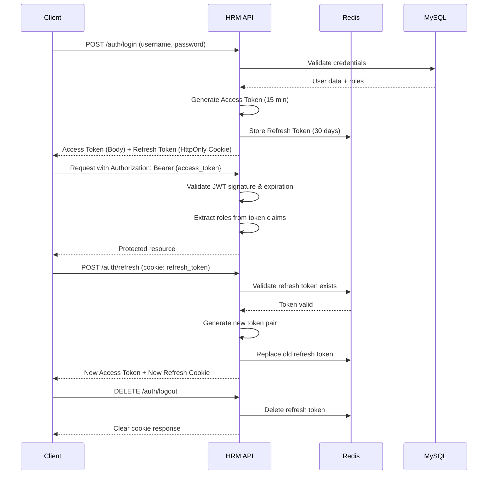

# 🏢 HRM Attendance Backend API

[](https://spring.io/projects/spring-boot)
[](https://www.oracle.com/java/)
[](https://www.mysql.com/)
[](https://redis.io/)
[](https://www.docker.com/)
[](LICENSE)

> **Production-ready Backend API for Human Resource Management & Attendance System**  
> Part of a distributed HRM ecosystem with AI-powered face recognition capabilities.

---

## 📋 Table of Contents

1. [Project Overview](#-project-overview)
2. [Backend Architecture](#-backend-architecture)
3. [Technology Stack](#-technology-stack)
4. [Project Structure](#-project-structure)
5. [Authentication & Authorization Flow](#-authentication--authorization-flow)
6. [API Security Design](#-api-security-design)
7. [Database Design Overview](#-database-design-overview)
8. [Redis Usage](#-redis-usage)
9. [External Service Integration](#-external-service-integration)
10. [Environment Variables](#-environment-variables)
11. [Running Locally](#-running-locally)
12. [API Endpoint Examples](#-api-endpoint-examples)
13. [Deployment Overview](#-deployment-overview)
14. [Error Handling Strategy](#-error-handling-strategy)
15. [Future Improvements](#-future-improvements)
16. [Author](#-author)

---

## 🎯 Project Overview

The **HRM Attendance Backend API** serves as the core backend service for a comprehensive Human Resource Management system. It provides RESTful endpoints for managing employees, contracts, attendance records, payroll processing, and leave management. The system features AI-powered face recognition for contactless attendance tracking.

### Key Capabilities

| Feature | Description |
|---------|-------------|
| 🔐 **Authentication** | JWT-based stateless authentication with access & refresh tokens |
| 👤 **Employee Management** | CRUD operations, bulk import/export via Excel |
| 📅 **Attendance Tracking** | Face recognition check-in/out with real-time processing |
| 💰 **Payroll Processing** | Automated salary calculation with adjustments & allowances |
| 🏖️ **Leave Management** | Request workflow with approval chains |
| 🏢 **Organization Structure** | Department & position hierarchy management |
| 📊 **Reporting** | Excel export capabilities across modules |

---

## 🏗️ Backend Architecture

```
┌─────────────────────────────────────────────────────────────────────────────┐
│                              CLIENT LAYER                                    │
│  ┌─────────────────┐  ┌─────────────────┐  ┌─────────────────────────────┐  │
│  │  React Web App  │  │  Android Mobile │  │  Face Recognition Service   │  │
│  │   (Admin Panel) │  │    (Employee)   │  │      (Python/FastAPI)       │  │
│  └────────┬────────┘  └────────┬────────┘  └─────────────────────────────┘  │
└───────────┼────────────────────┼────────────────────────────────────────────┘
            │                    │
            └────────────────────┘
                       │
┌──────────────────────▼──────────────────────────────────────────────────────┐
│                           API GATEWAY LAYER                                  │
│                      HTTPS / Reverse Proxy (Nginx)                           │
└──────────────────────┬──────────────────────────────────────────────────────┘
                       │
┌──────────────────────▼──────────────────────────────────────────────────────┐
│                         APPLICATION LAYER                                    │
│                    Spring Boot 3.4.1 (Java 21)                               │
│  ┌─────────────────────────────────────────────────────────────────────┐     │
│  │  ┌─────────────┐  ┌─────────────┐  ┌─────────────┐  ┌────────────┐  │     │
│  │  │ Controllers │──│  Services   │──│ Repositories│──│   Entities │  │     │
│  │  └─────────────┘  └─────────────┘  └─────────────┘  └────────────┘  │     │
│  │  ┌─────────────┐  ┌─────────────┐  ┌─────────────┐                  │     │
│  │  │    DTOs     │  │   Mappers   │  │   Security  │                  │     │
│  │  └─────────────┘  └─────────────┘  └─────────────┘                  │     │
│  └─────────────────────────────────────────────────────────────────────┘     │
└──────────────────────┬──────────────────────────────────────────────────────┘
                       │
        ┌──────────────┼──────────────┐
        │              │              │
┌───────▼──────┐ ┌────▼─────┐ ┌──────▼──────┐
│   MySQL      │ │  Redis   │ │  SMTP       │
│  (Primary DB)│ │ (Cache & │ │  (Email)    │
│              │ │ Sessions)│ │             │
└──────────────┘ └──────────┘ └─────────────┘
```

### Architectural Patterns

- **Layered Architecture**: Clear separation between Controller → Service → Repository layers
- **Domain-Driven Design**: Business logic organized by functional modules
- **Stateless Services**: All services are stateless, enabling horizontal scaling
- **DTO Pattern**: Data transfer objects for API contracts
- **Mapper Pattern**: MapStruct for entity-DTO conversions

---

## 🛠️ Technology Stack

### Core Framework

| Component | Technology | Version | Purpose |
|-----------|------------|---------|---------|
| Framework | Spring Boot | 3.4.1 | Application foundation |
| Language | Java | 21 | Primary language |
| Security | Spring Security | 6.x | Authentication & authorization |
| Data Access | Spring Data JPA | 3.4.x | Database abstraction |
| Validation | Jakarta Validation | 3.x | Input validation |
| Scheduling | Spring Scheduler | 3.4.x | Cron jobs & background tasks |

### Security & Authentication

| Component | Technology | Purpose |
|-----------|------------|---------|
| JWT Library | Nimbus JOSE+JWT | Token generation & verification |
| Password Hashing | BCrypt | Secure password storage |
| Token Storage | Redis | Refresh token management |

### Data Storage

| Component | Technology | Purpose |
|-----------|------------|---------|
| Primary Database | MySQL 8.0 | Persistent data storage |
| Connection Pool | HikariCP | High-performance connection pooling |
| Cache & Sessions | Redis | Distributed caching & token store |
| ORM | Hibernate 6.x | JPA implementation |

### Integration & Utilities

| Component | Technology | Purpose |
|-----------|------------|---------|
| HTTP Client | Apache HttpClient 5 | External API calls |
| Excel Processing | Apache POI | Import/Export functionality |
| Email | Spring Mail | SMTP email notifications |
| Image Processing | Thumbnailator | Image resizing & optimization |
| Mapping | MapStruct 1.6.0 | Entity-DTO mapping |
| Build Tool | Maven | Dependency management |

---

## 📁 Project Structure

```
hrm-attendance-backend/
├── src/main/java/com/example/hrm/
│   ├── HrmApplication.java              # Application entry point
│   ├── modules/                         # Domain modules
│   │   ├── auth/                        # Authentication & authorization
│   │   │   ├── controller/              # Auth endpoints (login, refresh, logout)
│   │   │   ├── dto/                     # Auth request/response DTOs
│   │   │   └── service/                 # JWT & auth business logic
│   │   ├── user/                        # User account management
│   │   ├── employee/                    # Employee CRUD & face registration
│   │   ├── attendance/                  # Check-in/out & attendance records
│   │   ├── contract/                    # Employment contracts
│   │   ├── payroll/                     # Salary calculation & processing
│   │   ├── leave/                       # Leave requests & balances
│   │   ├── organization/                # Departments & positions
│   │   ├── penalty/                     # Violation rules & penalties
│   │   ├── file/                        # File attachment handling
│   │   └── face_recognition/            # Face recognition integration
│   └── shared/                          # Cross-cutting concerns
│       ├── configuration/               # Spring configurations
│       │   ├── SecurityConfiguration.java
│       │   ├── RedisConfig.java
│       │   └── filter/                  # JWT filter
│       ├── exception/                   # Global exception handling
│       ├── enums/                       # Domain enumerations
│       ├── call_api/                    # External API clients
│       ├── excel/                       # Excel utilities
│       └── security/                    # Security utilities
├── src/main/resources/
│   └── application.yml                  # Environment configurations
├── Dockerfile                           # Multi-stage Docker build
├── docker-compose.yml                   # Local development stack
└── pom.xml                              # Maven dependencies
```

### Module Breakdown

| Module | APIs | Description |
|--------|------|-------------|
| `auth` | 5 | Login, logout, token refresh, account activation |
| `user` | 11 | User accounts, roles & permissions |
| `employee` | 30 | Employee management, face registration, locations |
| `contract` | 25 | Contracts, salary agreements, allowances |
| `organization` | 19 | Departments, sub-departments, positions |
| `attendance` | 16 | Check-in/out, break times, OT rates |
| `leave` | 9 | Leave requests, approvals, balance tracking |
| `payroll` | 13 | Salary calculation, payroll cycles |
| `penalty` | 6 | Penalty rules & violation tracking |
| `file` | 3 | File upload/download management |

---

## 🔐 Authentication & Authorization Flow

### Token Architecture

The system implements a **dual-token authentication strategy**:

```
┌─────────────────────────────────────────────────────────────────┐
│                     TOKEN LIFECYCLE                              │
├─────────────────────────────────────────────────────────────────┤
│                                                                  │
│   ┌──────────────┐         ┌──────────────┐                     │
│   │ Access Token │         │ Refresh Token│                     │
│   ├──────────────┤         ├──────────────┤                     │
│   │ TTL: 15 min  │         │ TTL: 30 days │                     │
│   │ Storage:     │         │ Storage:     │                     │
│   │   Header     │         │   HttpOnly   │                     │
│   │   (Bearer)   │         │   Cookie     │                     │
│   └──────────────┘         └──────────────┘                     │
│          │                          │                           │
│          ▼                          ▼                           │
│   ┌──────────────┐         ┌──────────────┐                     │
│   │  API Access  │         │ Redis Store  │                     │
│   │  Authorization│        │ (Token Set)  │                     │
│   └──────────────┘         └──────────────┘                     │
│                                                                  │
└─────────────────────────────────────────────────────────────────┘
```

### Authentication Flow



### Authorization Model

| Role | Permissions |
|------|-------------|
| `ADMIN` | Full system access |
| `HR_MANAGER` | Employee, contract, payroll management |
| `HR_STAFF` | Employee data entry, attendance records |
| `MANAGER` | Team leave approvals, attendance viewing |
| `EMPLOYEE` | Self-service: profile, leaves, attendance |

---

## 🛡️ API Security Design

### Security Measures

| Layer | Implementation |
|-------|----------------|
| **Transport** | HTTPS enforced in production |
| **CORS** | Configured for specific origins |
| **CSRF** | Disabled for stateless JWT design |
| **Authentication** | JWT Bearer tokens |
| **Authorization** | Method-level @PreAuthorize annotations |
| **Input Validation** | Jakarta Validation on all DTOs |
| **Password Security** | BCrypt hashing (strength 10) |
| **Token Storage** | HttpOnly, Secure, SameSite cookies |

### Public vs Protected Endpoints

```java
// Public endpoints (no authentication required)
POST   /api/v1/auth/login
POST   /api/v1/auth/refresh
POST   /api/v1/auth/activate
POST   /api/v1/employees/faces/recognize
POST   /api/v1/attendance/scan
GET    /hello

// Protected endpoints (authentication required)
All other endpoints require valid JWT in Authorization header

// Admin-only endpoints
/api/v1/dev/**
```

### Security Headers

```yaml
# Implemented via Spring Security
X-Content-Type-Options: nosniff
X-Frame-Options: DENY
X-XSS-Protection: 1; mode=block
Strict-Transport-Security: max-age=31536000; includeSubDomains
```

---

## 🗄️ Database Design Overview

### Entity Relationship Overview

```
┌─────────────────┐     ┌─────────────────┐     ┌─────────────────┐
│    Employee     │────▶│  UserAccount    │────▶│      Role       │
│   (Central)     │     │  (Auth)         │     │  (Permissions)  │
└────────┬────────┘     └─────────────────┘     └─────────────────┘
         │
         │     ┌─────────────────┐     ┌─────────────────┐
         ├────▶│    Contract     │────▶│ SalaryContract  │
         │     └─────────────────┘     └─────────────────┘
         │
         │     ┌─────────────────┐     ┌─────────────────┐
         ├────▶│   Attendance    │◀────│    BreakTime    │
         │     └─────────────────┘     └─────────────────┘
         │
         │     ┌─────────────────┐     ┌─────────────────┐
         ├────▶│  LeaveRequest   │────▶│  LeaveBalance   │
         │     └─────────────────┘     └─────────────────┘
         │
         │     ┌─────────────────┐
         └────▶│     Payroll     │
               └─────────────────┘

┌─────────────────┐     ┌─────────────────┐     ┌─────────────────┐
│   Department    │◀────│ SubDepartment   │◀────│   Position      │
│  (Organization) │     │  (Organization) │     │  (Organization) │
└─────────────────┘     └─────────────────┘     └─────────────────┘
```

### Key Tables

| Table | Purpose | Key Fields |
|-------|---------|------------|
| `employees` | Core employee data | id, employee_code, full_name, email, status |
| `user_accounts` | Login credentials | username, password_hash, status, employee_id |
| `roles` | Permission groups | name, permissions (JSON) |
| `contracts` | Employment agreements | employee_id, start_date, end_date, status |
| `salary_contracts` | Salary details | contract_id, base_salary, effective_date |
| `attendance` | Daily attendance records | employee_id, date, check_in, check_out, status |
| `leave_requests` | Leave applications | employee_id, start_date, end_date, type, status |
| `payroll` | Monthly salary records | employee_id, month, gross_salary, net_salary |
| `departments` | Organization units | name, code, manager_id |
| `face_data` | Face recognition refs | employee_id, face_vector_id (external) |

### Database Configuration

```yaml
# HikariCP Connection Pool
maximum-pool-size: 10
minimum-idle: 5
idle-timeout: 300000
max-lifetime: 1200000
connection-timeout: 30000
```

---

## ⚡ Redis Usage

### Redis Data Model

```
┌─────────────────────────────────────────────────────────────────┐
│                      REDIS KEY PATTERNS                          │
├─────────────────────────────────────────────────────────────────┤
│                                                                  │
│  # Refresh Token Storage                                         │
│  refreshToken:{jwtId} → username                                 │
│  TTL: 30 days                                                    │
│                                                                  │
│  # User Token Index (for logout all)                             │
│  user:{username}:tokens → Set<jwtId>                             │
│                                                                  │
└─────────────────────────────────────────────────────────────────┘
```

### Redis Operations

| Operation | Key Pattern | Description |
|-----------|-------------|-------------|
| Store Token | `refreshToken:{jti}` | Store refresh token with TTL |
| Validate Token | `GET refreshToken:{jti}` | Check token existence |
| Index Token | `SADD user:{username}:tokens {jti}` | Add to user's token set |
| Revoke Token | `DEL refreshToken:{jti}` | Single token revocation |
| Revoke All | `DEL user:{username}:tokens` + iterate | Logout all devices |

### Configuration

```java
@Bean
public RedisTemplate<String, String> redisTemplate(
    RedisConnectionFactory factory) {
    RedisTemplate<String, String> template = new RedisTemplate<>();
    template.setConnectionFactory(factory);
    template.setKeySerializer(new StringRedisSerializer());
    template.setValueSerializer(new StringRedisSerializer());
    return template;
}
```

---

## 🔌 External Service Integration

### Face Recognition Microservice

The system integrates with an external Python-based face recognition service for AI-powered attendance verification.

#### Service Configuration

```yaml
face-recognition:
  base-url: ${FACE_RECOGNITION_BASE_URL}
  endpoints:
    register: /facial-recognition/register-face
    recognize: /facial-recognition/face-recognition
    update: /facial-recognition/update-face
    delete: /facial-recognition/delete-face
    register-batch: /facial-recognition/register-face-batch
```

#### API Operations

| Operation | Endpoint | Description |
|-----------|----------|-------------|
| Register | `POST /register-face` | Enroll employee face vectors |
| Recognize | `POST /face-recognition` | Identify employee from image |
| Update | `PUT /update-face` | Update face data |
| Delete | `DELETE /delete-face` | Remove face data |
| Batch Register | `POST /register-face-batch` | Bulk enrollment via ZIP |

#### Integration Flow

```
┌──────────────┐      ┌──────────────────┐      ┌─────────────────────┐
│   Employee   │      │   HRM Backend    │      │  Face Recognition   │
│   Device     │─────▶│   (This API)     │─────▶│  Service (Python)   │
└──────────────┘      └──────────────────┘      └─────────────────────┘
       │                      │                           │
       │  1. Upload image     │                           │
       │─────────────────────▶│                           │
       │                      │  2. Forward image         │
       │                      │──────────────────────────▶│
       │                      │                           │
       │                      │  3. Return employee_id    │
       │                      │◀──────────────────────────│
       │                      │                           │
       │                      │  4. Record attendance     │
       │                      │  5. Return result         │
       │◀─────────────────────│                           │
```

---

## 🔧 Environment Variables

### Required Environment Variables

```bash
# ==========================================
# SERVER CONFIGURATION
# ==========================================
SERVER_PORT=8080
SPRING_PROFILES_ACTIVE=dev

# ==========================================
# DATABASE CONFIGURATION
# ==========================================
DB_URL=jdbc:mysql://localhost:3306/hrm_db
DB_USERNAME=root
DB_PASSWORD=your_secure_password
DB_DRIVER=com.mysql.cj.jdbc.Driver
DB_POOL_MAX_SIZE=10
DB_POOL_MIN_IDLE=5
DB_POOL_IDLE_TIMEOUT=300000
DB_POOL_MAX_LIFETIME=1200000
DB_POOL_CONNECTION_TIMEOUT=30000

# ==========================================
# REDIS CONFIGURATION
# ==========================================
REDIS_HOST=localhost
REDIS_PORT=6379
REDIS_PASSWORD=

# ==========================================
# JWT CONFIGURATION
# ==========================================
# HS512 keys (min 512 bits / 64 bytes)
JWT_SIGNER_KEY_ACCESS=your-secure-access-key-min-64-chars-long
JWT_SIGNER_KEY_REFRESH=your-secure-refresh-key-min-64-chars-long
JWT_SIGNER_KEY_ACTIVATION=your-secure-activation-key-min-64-chars-long
JWT_ACCESS_DURATION=900        # 15 minutes
JWT_REFRESH_DURATION=2592000   # 30 days
JWT_ACTIVATION_DURATION=900    # 15 minutes

# ==========================================
# EMAIL CONFIGURATION
# ==========================================
MAIL_HOST=smtp.gmail.com
MAIL_PORT=587
MAIL_USERNAME=your-email@gmail.com
MAIL_PASSWORD=your-app-password
MAIL_SMTP_AUTH=true
MAIL_SMTP_STARTTLS_ENABLE=true
MAIL_BASE_URL=http://localhost:5173/active-account

# ==========================================
# FILE UPLOAD CONFIGURATION
# ==========================================
UPLOAD_DIR=./uploads
UPLOAD_MAX_FILE_SIZE=50MB
UPLOAD_MAX_REQUEST_SIZE=50MB

# ==========================================
# SECURITY CONFIGURATION
# ==========================================
COOKIE_SECURE=false        # true for HTTPS
COOKIE_SAME_SITE=Lax       # None for cross-domain

# ==========================================
# FACE RECOGNITION SERVICE
# ==========================================
FACE_RECOGNITION_BASE_URL=http://localhost:8000
FACE_RECOGNITION_REGISTER_API=/facial-recognition/register-face
FACE_RECOGNITION_RECOGNIZE_API=/facial-recognition/face-recognition
FACE_RECOGNITION_UPDATE_API=/facial-recognition/update-face
FACE_RECOGNITION_DELETE_API=/facial-recognition/delete-face
FACE_RECOGNITION_REGISTER_BATCH_API=/facial-recognition/register-face-batch
```

### Profile-Specific Configurations

| Profile | Use Case | Database | Redis |
|---------|----------|----------|-------|
| `dev` | Local development | Local MySQL | Local Redis |
| `pro` | Production | TiDB Cloud | Redis Cloud |

---

## 🚀 Running Locally

### Prerequisites

- Java 21 (JDK)
- Maven 3.8+
- MySQL 8.0
- Redis 7.0
- Docker & Docker Compose (optional)

### Option 1: Using Docker Compose (Recommended)

```bash
# Clone the repository
git clone https://github.com/TRONGG2005k/hrm.git
cd hrm

# Create .env file from template
copy .env.example .env
# Edit .env with your configurations

# Start all services
docker-compose up -d

# View logs
docker-compose logs -f app

# Stop services
docker-compose down
```

### Option 2: Manual Setup

```bash
# 1. Start MySQL
docker run -d \
  --name hrm-mysql \
  -e MYSQL_ROOT_PASSWORD=123456 \
  -e MYSQL_DATABASE=hrm_db \
  -p 3306:3306 \
  mysql:8.0

# 2. Start Redis
docker run -d \
  --name hrm-redis \
  -p 6379:6379 \
  redis:7-alpine

# 3. Build the application
./mvnw clean package -DskipTests

# 4. Run the application
java -jar target/hrm-0.0.1-SNAPSHOT.jar

# Or using Maven
./mvnw spring-boot:run -Dspring-boot.run.profiles=dev
```

### Verify Installation

```bash
# Health check
curl http://localhost:8080/hello

# Expected response:
# "Hello from HRM API"
```

---

## 📡 API Endpoint Examples

### Authentication

```bash
# Login
curl -X POST http://localhost:8080/api/v1/auth/login \
  -H "Content-Type: application/json" \
  -d '{
    "username": "admin",
    "password": "password123"
  }'

# Response:
# {
#   "accessToken": "eyJhbGciOiJIUzUxMiJ9...",
#   "roles": ["ADMIN"]
# }
# Set-Cookie: refresh_token=eyJhbGciOiJIUzUxMiJ9...; HttpOnly; Secure; SameSite=None

# Refresh Token
curl -X POST http://localhost:8080/api/v1/auth/refresh \
  -H "Cookie: refresh_token=eyJhbGciOiJIUzUxMiJ9..."

# Logout
curl -X DELETE http://localhost:8080/api/v1/auth/logout \
  -H "Cookie: refresh_token=eyJhbGciOiJIUzUxMiJ9..."
```

### Employee Management

```bash
# Create Employee
curl -X POST http://localhost:8080/api/v1/employees \
  -H "Authorization: Bearer {access_token}" \
  -H "Content-Type: application/json" \
  -d '{
    "employeeCode": "EMP001",
    "fullName": "John Doe",
    "email": "john.doe@company.com",
    "departmentId": 1,
    "positionId": 1
  }'

# List Employees (Paginated)
curl "http://localhost:8080/api/v1/employees?page=0&size=20" \
  -H "Authorization: Bearer {access_token}"

# Import Employees from Excel
curl -X POST http://localhost:8080/api/v1/employees/import \
  -H "Authorization: Bearer {access_token}" \
  -F "file=@employees.xlsx"
```

### Attendance

```bash
# Face Recognition Check-in/Out (Public endpoint)
curl -X POST http://localhost:8080/api/v1/attendance/scan \
  -F "file=@face_image.jpg"

# Get Attendance Records
curl "http://localhost:8080/api/v1/attendance?date=2024-01-15" \
  -H "Authorization: Bearer {access_token}"
```

### Face Recognition

```bash
# Register Face (Base64 images)
curl -X POST http://localhost:8080/api/v1/employees/EMP001/faces \
  -H "Authorization: Bearer {access_token}" \
  -H "Content-Type: application/json" \
  -d '{
    "images": ["base64encodedstring1", "base64encodedstring2"]
  }'

# Batch Register (ZIP file)
curl -X POST http://localhost:8080/api/v1/employees/faces/batch \
  -H "Authorization: Bearer {access_token}" \
  -F "file=@employee_faces.zip"
```

### Payroll

```bash
# Generate Payroll for All
curl -X POST http://localhost:8080/api/v1/payroll \
  -H "Authorization: Bearer {access_token}" \
  -H "Content-Type: application/json" \
  -d '{
    "month": "2024-01",
    "payrollCycleId": 1
  }'

# Get Employee Payroll
curl "http://localhost:8080/api/v1/payroll/EMP001?month=2024-01" \
  -H "Authorization: Bearer {access_token}"
```

---

## 🌐 Deployment Overview

### Production Architecture

```
┌─────────────────────────────────────────────────────────────────────────────┐
│                              AWS CLOUD                                       │
│                                                                              │
│  ┌──────────────────────────────────────────────────────────────────────┐   │
│  │                         VPC                                          │   │
│  │                                                                      │   │
│  │   ┌─────────────┐      ┌─────────────┐      ┌─────────────┐         │   │
│  │   │   Route 53  │─────▶│ CloudFront  │─────▶│    ALB      │         │   │
│  │   │   (DNS)     │      │   (CDN)     │      │  (HTTPS)    │         │   │
│  │   └─────────────┘      └─────────────┘      └──────┬──────┘         │   │
│  │                                                    │                │   │
│  │   ┌────────────────────────────────────────────────┼────────────┐   │   │
│  │   │            EC2 Auto Scaling Group              │            │   │   │
│  │   │                                                ▼            │   │   │
│  │   │   ┌─────────────┐    ┌─────────────┐    ┌─────────────┐     │   │   │
│  │   │   │  HRM API    │    │  HRM API    │    │  HRM API    │     │   │   │
│  │   │   │  Instance 1 │    │  Instance 2 │    │  Instance N │     │   │   │
│  │   │   └──────┬──────┘    └──────┬──────┘    └──────┬──────┘     │   │   │
│  │   └──────────┼──────────────────┼──────────────────┼────────────┘   │   │
│  │              │                  │                  │                │   │
│  │              ▼                  ▼                  ▼                │   │
│  │   ┌─────────────────────────────────────────────────────────────┐  │   │
│  │   │              TiDB Cloud (MySQL Compatible)                   │  │   │
│  │   │                   (Primary Database)                         │  │   │
│  │   └─────────────────────────────────────────────────────────────┘  │   │
│  │                                                                     │   │
│  │   ┌─────────────────────────────────────────────────────────────┐  │   │
│  │   │              Redis Cloud (ElastiCache)                       │  │   │
│  │   │            (Session & Cache Storage)                         │  │   │
│  │   └─────────────────────────────────────────────────────────────┘  │   │
│  │                                                                     │   │
│  └─────────────────────────────────────────────────────────────────────┘   │
│                                                                              │
└─────────────────────────────────────────────────────────────────────────────┘
```

### Deployment Steps

1. **Build Docker Image**
   ```bash
   docker build -t hrm-api:latest .
   ```

2. **Push to Container Registry**
   ```bash
   docker tag hrm-api:latest your-registry/hrm-api:latest
   docker push your-registry/hrm-api:latest
   ```

3. **Deploy on EC2**
   ```bash
   # SSH to EC2 instance
   ssh -i key.pem ec2-user@your-ec2-ip
   
   # Pull and run
   docker pull your-registry/hrm-api:latest
   docker run -d \
     --name hrm-api \
     --env-file .env \
     -p 8080:8080 \
     your-registry/hrm-api:latest
   ```

4. **Configure Nginx Reverse Proxy**
   ```nginx
   server {
       listen 443 ssl http2;
       server_name api.hrm.yourdomain.com;
       
       ssl_certificate /path/to/cert.pem;
       ssl_certificate_key /path/to/key.pem;
       
       location / {
           proxy_pass http://localhost:8080;
           proxy_set_header Host $host;
           proxy_set_header X-Real-IP $remote_addr;
           proxy_set_header X-Forwarded-For $proxy_add_x_forwarded_for;
           proxy_set_header X-Forwarded-Proto $scheme;
       }
   }
   ```

---

## ⚠️ Error Handling Strategy

### Error Response Format

```json
{
  "timestamp": "2024-01-15T10:30:00",
  "status": 400,
  "error": "E1002",
  "message": "Employee code already exists",
  "details": "Employee code EMP001 is already in use",
  "path": "/api/v1/employees",
  "validationErrors": {
    "employeeCode": "Employee code already exists"
  }
}
```

### Error Code Ranges

| Range | Category |
|-------|----------|
| E1000-E1999 | Employee errors |
| E2000-E2999 | User account errors |
| E3000-E3999 | Department errors |
| E4000-E4999 | Sub-department errors |
| E5000-E5999 | Contract errors |
| E6000-E6999 | Salary contract errors |
| E7000-E7999 | Attendance errors |
| E8000-E8999 | Leave errors |
| E9000-E9999 | Payroll errors |
| E20000-E20999 | Validation errors |
| E40000-E40999 | Server errors |
| E60000-E60999 | Token errors |

### Exception Handling Layers

```
┌─────────────────────────────────────────┐
│   GlobalExceptionHandler                │
│   (@RestControllerAdvice)               │
│                                         │
│   - AppException (Business logic)       │
│   - ValidationException (Input)         │
│   - AccessDeniedException (Security)    │
│   - Exception (Fallback)                │
└─────────────────────────────────────────┘
                    │
                    ▼
┌─────────────────────────────────────────┐
│   Standardized ErrorResponse            │
│   (JSON with timestamp, code, message)  │
└─────────────────────────────────────────┘
```

---

## 🚀 Future Improvements

### Planned Enhancements

| Priority | Feature | Description |
|----------|---------|-------------|
| 🔴 High | API Documentation | OpenAPI 3.0 / Swagger UI integration |
| 🔴 High | Rate Limiting | Bucket4j for API throttling |
| 🔴 High | Audit Logging | Entity change tracking |
| 🟡 Medium | WebSocket | Real-time attendance notifications |
| 🟡 Medium | Elasticsearch | Full-text search for employees |
| 🟡 Medium | Metrics | Micrometer + Prometheus monitoring |
| 🟢 Low | Multi-tenancy | SaaS support for multiple companies |
| 🟢 Low | GraphQL | Alternative API layer |

### Technical Debt

- [ ] Increase unit test coverage to >80%
- [ ] Implement integration tests with TestContainers
- [ ] Add database migration tool (Flyway/Liquibase)
- [ ] Centralize configuration with Spring Cloud Config
- [ ] Implement distributed tracing with Sleuth + Zipkin

---

## 👤 Author

**HRM Development Team**

- 📧 Email: tn0961350951@gmail.com
- 🌐 Website: https://hrm-db.duckdns.org/
- 💻 GitHub: [TRONGG2005k/hrm](https://github.com/TRONGG2005k/hrm)

---

## 📄 License

This project is licensed under the MIT License - see the [LICENSE](LICENSE) file for details.

---

<div align="center">
  <sub>Built with ❤️ by the HRM Team</sub>
</div>
